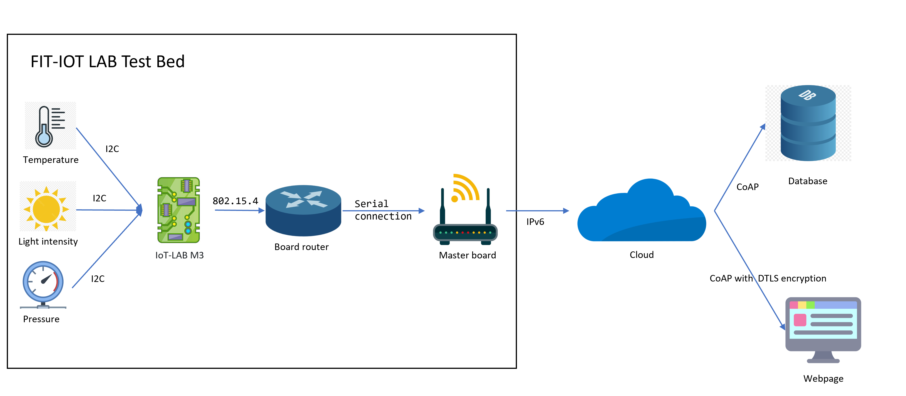
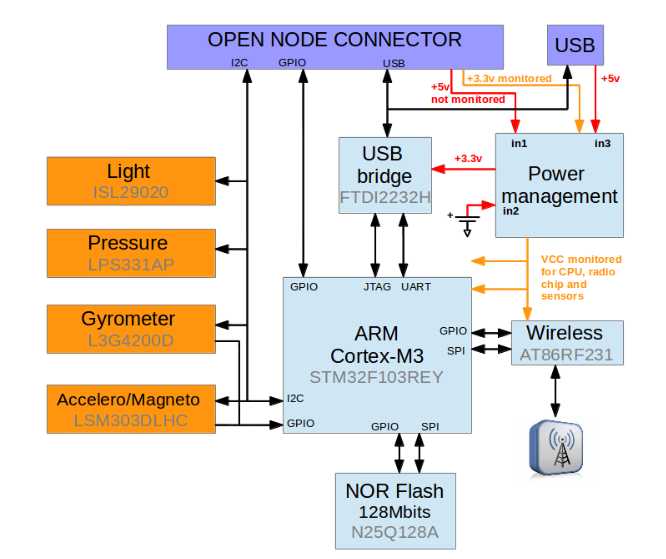
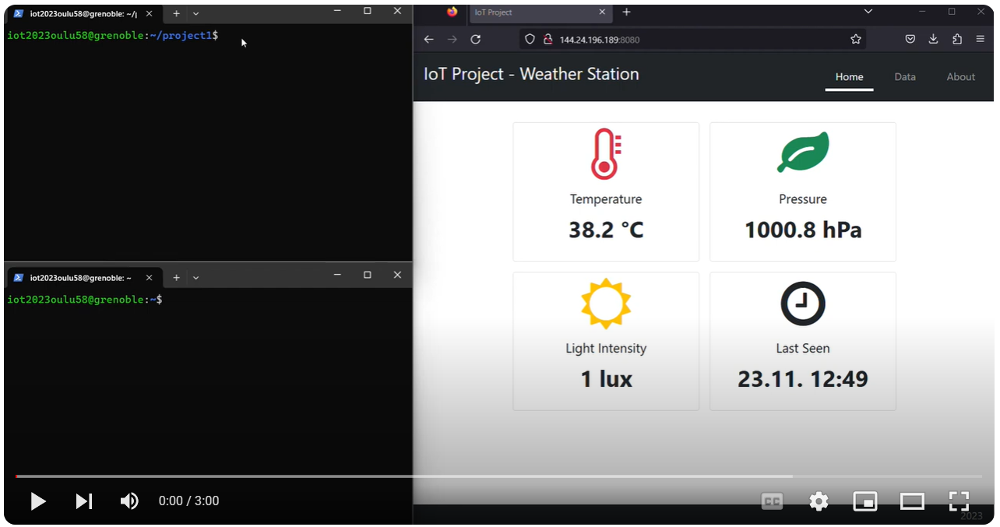

# Project 1 - Internet of Things - 521043S-3004

**Group Members**
- Miroslav Chalko
- Kuisma Hannuksela
- Sehani Siriwardana
---
## Introduction to project


### Description

This is a project for IoT course at the university of Oulu. Aim of the [assignment](assignment.pdf) was to create a basic IoT pipeline, while using a remote MCU testbed provided by [FIT IOT-LAB](https://www.iot-lab.info/). Our implementation is a simple, single-node weather app. The end-node acquires weather data, such as temperature, pressure and light, and sends them to server. The server keeps valid data in a database and visualizes it using a custom web interface.



---

## Technologies used in project

### Hardware

Hardware is provided by a remote testbed, [FIT IOT-LAB](https://www.iot-lab.info/). We used the [IoT-LaB M3](https://www.iot-lab.info/docs/boards/iot-lab-m3/) board, based on STM32F103REY (ARM Cortex M3). This board was specifically designed for the testbed, offers a lot of sensors as well as serial & 802.15.4 interfaces. Used sensors in this project:
- **ISL29020** - light sensor measuring both visible and IR light intensity
- **LPS331AP** - pressure and Temperature sensor 
Both sensors are connected to I2C bus.




### End Node

The FIT IOT-LAB M3 board is running [RIOT](https://www.riot-os.org) operating system. It periodically acquires data from the sensors and sends them to the server. To conserve energy, the board enters sleep mode between measurements. The length of sleep is dependant on measured delta (difference between current and previous measures), and the final sleep time is calculated using non-linear function. After boot, the board is waiting until the server connection is established, so make sure the server is running during tests. 

All the relevant parameters, for example sleep time, server address, or credentials can be adjusted in the [config](end-node/config.h) file.

### Border Router

Since the M3 board does not have direct access to internet, border router is used to route traffic. The end node and border router are connected to the same 802.15.4 network, e.g. to the network with same ID. The border router accepts incoming packets and forwards them through serial interface towards master board. This second board has direct ipv6 connection, and forwards all the received packets. See more at [IOT-LAB](https://www.iot-lab.info/docs/getting-started/ipv6/)

There are no modifications to the border router firmware.

### Network layer 

The data acquired by end-node are transferred through the internet via IPv6 + DTLS + CoAP.

The IOT-LAB offers only IPv6 connection. CoAP was chosen due to its lightweightness and flexibility, in contrast to mqtt. However, it is relatively new and experimental, the libraries used in this project are still in early development and might contain bugs. Nonetheless, reliability is not a primary objective for weather app. Security is provided by DTLS, datagram layer security. Used libraries do not support certificates yet, so only id and passphrase is required to connect to the server.

### Server 

Any Linux machine with public IPv6 address can be used as a server. However, this project was developed, tested and used only using Ubuntu 22, behaviour might be different on other systems. 

#### CoAP server

CoAP server is implemented as a [python script](server/server.py) using [Aiocoap](https://aiocoap.readthedocs.io/en/latest/index.html) library. It defines several endpoints for clients, where they can send or get data. It also manages encryption side, by defining which endpoints are to be secured. After relevant data is received from an endpoint, it is stored in locally running MongoDB database.

#### Web interface

Web server is implemented as a [python script](server/web/web.py) using [Bottle](https://bottlepy.org/docs/dev/) web framework. The web pages are designed using [Bootstrap 5](https://getbootstrap.com/) fronted toolkit. After getting a client connection, the script queries MongoDB server to acquire data. Displayed time is shown in UTC, based on when data were inserted into the DB.

#### Database

[MongoDB](https://www.mongodb.com/) is used as the database for storage of acquired data. It's the most popular database used for python projects, especially if they won't need to access large amounts of data. It was chosen primarily due to the easy manipulation. Local MongoDB server needs to be installed and set up before running any of the other server-side python scripts. 

---

## Getting Started

- Clone this repository on a linux machine, install MongoDB, Python3, pymongo and aiocoap. Set up a replica set for MongoDB server. Do not forget to enable ports 8080 (web) and 5684 (CoAP) in firewall. 
- Run ```./server/start.sh``` to start all server side programs
- Connect to FIT IOT-LAB testbed using ssh, or install cli tools & build environment locally
- Clone repository, set up toolchain according to your own environment
- Authenticate yourself using ```iotlab-auth``` command
- Run ```python run.py -e -r``` to build and flash both the border router and end node firmware
- According to the script output, check available IPv6 interfaces and addresses in a given testbed side, and start router by running ```sudo ethos_uhcpd.py < router_id > < tap interface > < ipv6 address >```
- If you wish to view serial output of end-node, run ```nc < end node id > 20000```
- To finish up the experiment on the testbed and free up resources, run ``` python run.py -t``` 
- To stop the server run ```./server/stop.sh```

## Demonstration

[](https://youtu.be/iyjr8yyTiv8)
